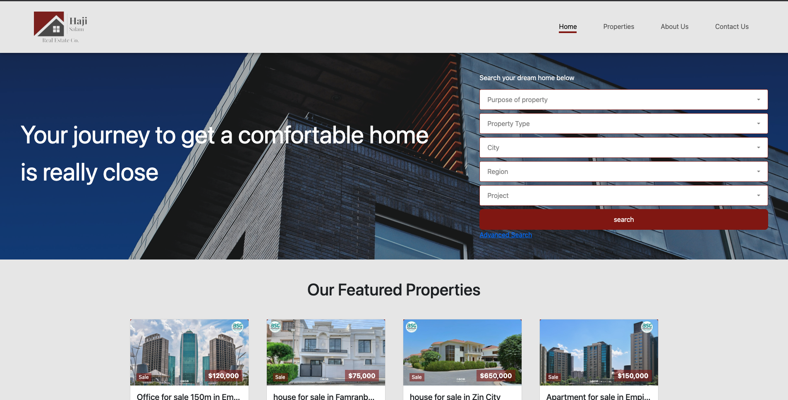
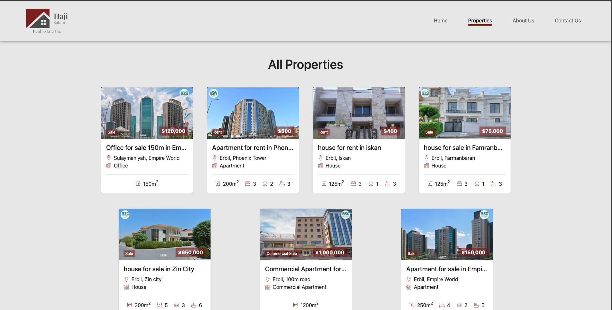
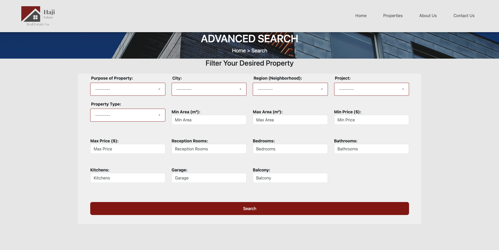
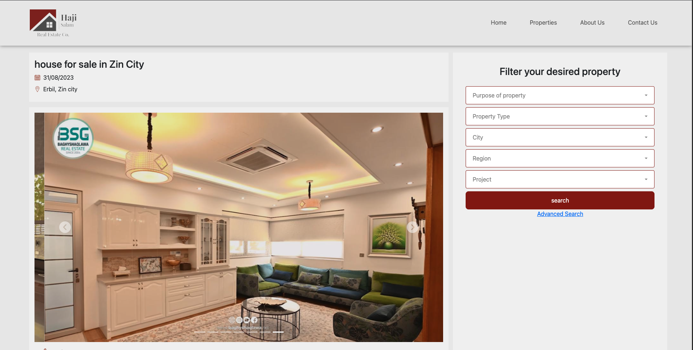
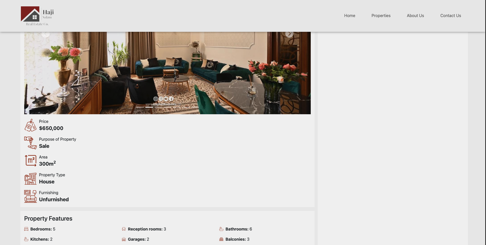

## Run Locally

**Python must be installed on your machine.**

- [download python here](https://apps.microsoft.com/detail/9ncvdn91xzqp?ocid=pdpshare&hl=en-us&gl=US)

### Clone the project

```bash
git clone https://github.com/aliii010/real_estate.git
```

### Go to the project directory

```bash
cd real_estate
```

### Set up a virtual environment

```bash
python -m venv venv
```

### Activate the virtual environment

```bash
venv\Scripts\activate
```

### Install the dependencies

```bash
pip install -r requirements.txt
```

### Run the migrations

```bash
 python manage.py migrate
```

### Run the server

```bash
python manage.py runserver
```

## Preview

### 🏡 Homepage



### 🏘️ Properties Page



### 🔎 Advanced Search Page



### 🧾 Detail Page



### 🗂️ Detail Page 2


